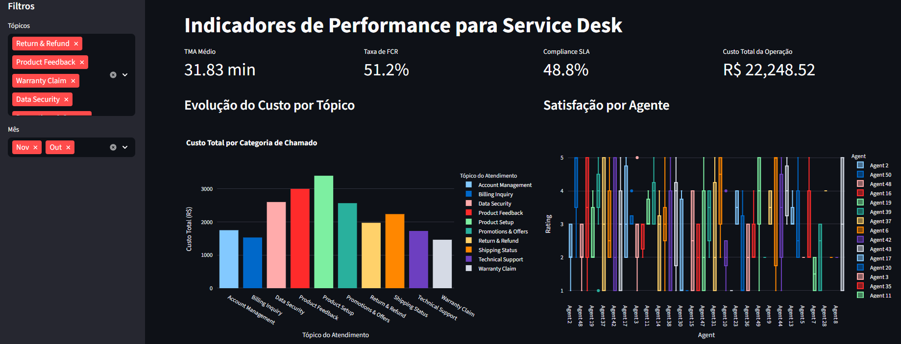

[](https://dashboard-service-desk-p2dvctuypxogxhksmldae7.streamlit.app/)
# Dashboard Service Desk Performance

Este projeto apresenta um Dashboard interativo para análise de indicadores de performance (KPIs) de uma operação de Service Desk, desenvolvido com **Python** e **Streamlit**.



## Objetivo
Transformar dados brutos de atendimento em insights estratégicos para gestão de TI, focando em eficiência operacional, custos e satisfação do cliente (baseado em frameworks como ITIL).

## Tecnologias Utilizadas
- **Python**: Linguagem base.
- **Pandas**: Manipulação e tratamento de dados.
- **Streamlit**: Framework para criação da interface web.
- **Plotly**: Gráficos interativos.

## KPIs Analisados
- **TMA (Tempo Médio de Atendimento)**: Eficiência na resolução de chamados.
- **FCR (First Call Resolution)**: Percentual de problemas resolvidos no primeiro contato.
- **SLA Compliance**: Percentual de chamados respondidos dentro do limite de 60 segundos.
- **CSAT (Customer Satisfaction)**: Nível de satisfação dos usuários (Notas 4 e 5).

## Estrutura do Projeto
```text
├── data/               # Base de dados (CSV)
├── src/                # Código fonte
│   ├── main.py         # Ponto de entrada da aplicação
│   ├── data_cleaning.py # Script de ETL e limpeza
│   ├── analisys.py      # Lógica de negócio e cálculos de KPIs
│   └── graphics.py      # Interface visual e gráficos
└── requirements.txt    # Dependências do projeto
